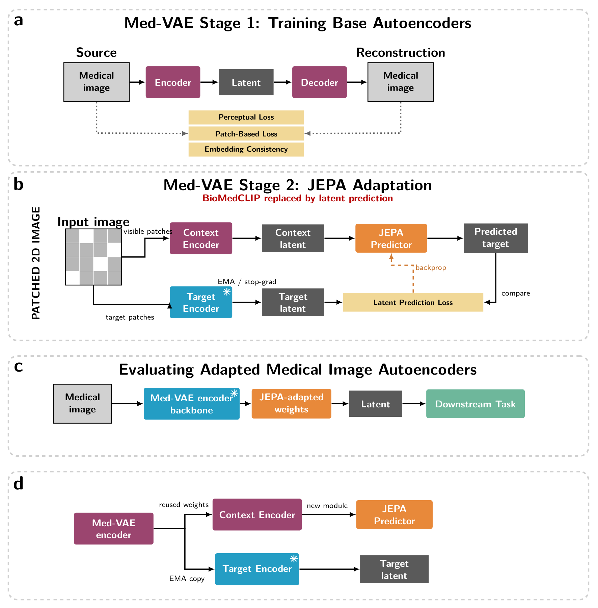
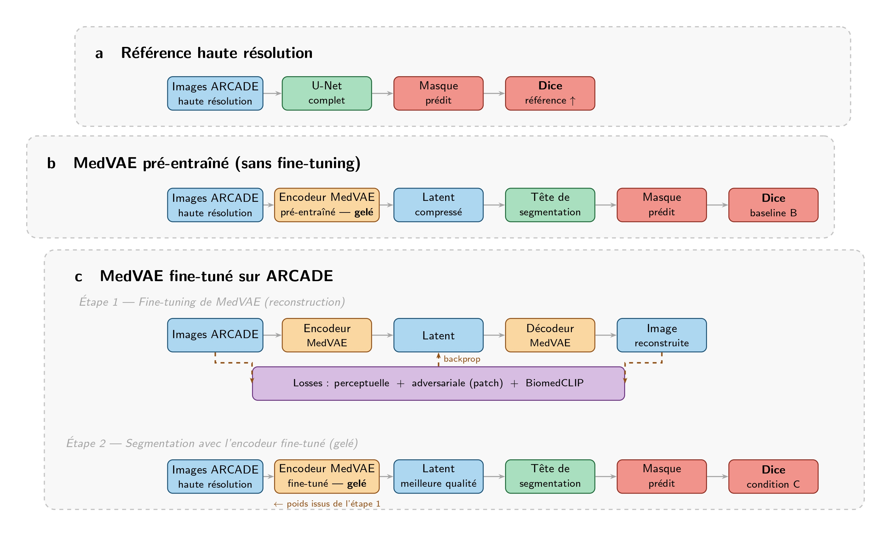

# projet_IM06

## JEPA adaptation of phase 2 medvae training (ROTHLINGSHOFER Yanic)

This project explores an adaptation of the second training stage of Med-VAE. In
the original pipeline, stage 2 relies on BioMedCLIP to preserve clinically
relevant information in the latent space. The goal here is to replace this
external vision-language supervision with a self-supervised JEPA objective,
directly learned from medical images.

The motivation is to make the adaptation less dependent on BioMedCLIP, whose
representations may not always match the target medical domain or imaging
modality. JEPA is a good fit because it trains the model to predict missing
latent information from visible context, encouraging semantic and structural
representations without reconstructing pixels. The design is inspired by I-JEPA:
a context encoder processes visible image patches, a frozen target encoder
provides target latent representations, and a predictor is trained with a latent
prediction loss.

*Figure: JEPA adaptation pipeline, inspired by the original Med-VAE pipeline figure.*

In practice, the Med-VAE encoder is reused as the backbone of the JEPA adapted
encoder. The BioMedCLIP-based consistency term is replaced by a latent
prediction loss between predicted target latents and frozen target encoder
latents. The adapted encoder can then be evaluated on downstream medical image
tasks.

## Fine-tuning MedVAE on New Medical Modalities (PALAGI Théo)

This project investigates whether fine-tuning MedVAE, which is a medical image autoencoder pre-trained on chest X-rays and mammographies, on a new imaging modality can improve downstream segmentation performance.  

We use the ARCADE dataset, which contains coronary angiography images annotated with 26 arterial segmentation classes. Coronary angiographies are structurally very different from the modalities MedVAE was trained on: they feature thin tubular structures, bifurcations, and stenosis regions that require fine-grained spatial encoding to be preserved under compression.
The core hypothesis is that a general-purpose medical encoder, while useful, may not capture the domain-specific visual features needed for precise vascular segmentation. Fine-tuning MedVAE on ARCADE images should push its latent space to better represent these structures, leading to better downstream performance.  

To test this, we design three comparable pipelines. The first trains a standard U-Net directly on full-resolution ARCADE images and serves as an upper-bound reference. The second uses the pre-trained MedVAE encoder to compress images into latent representations, which are then passed to a lightweight segmentation head, this measures how well the general model transfers to this new modality. The third repeats the second pipeline but with a MedVAE encoder that has been fine-tuned on ARCADE images beforehand, isolating the contribution of domain adaptation.
All three pipelines are evaluated using the mean Dice score across the 26 arterial classes on a held-out test set. The gap between the second and third conditions directly quantifies the benefit of fine-tuning MedVAE on a previously unseen medical modality.

