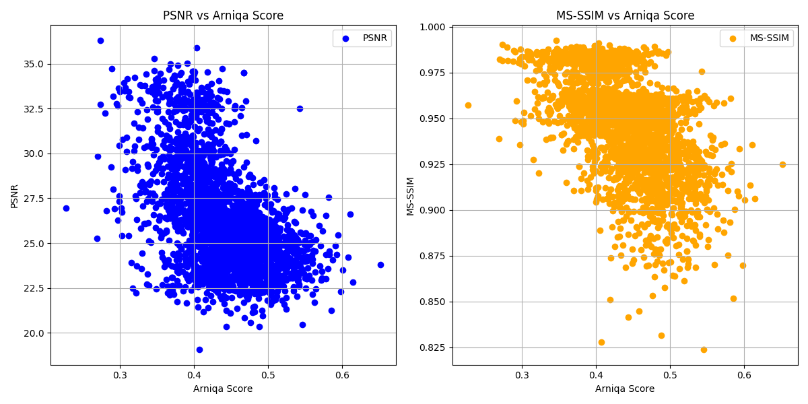
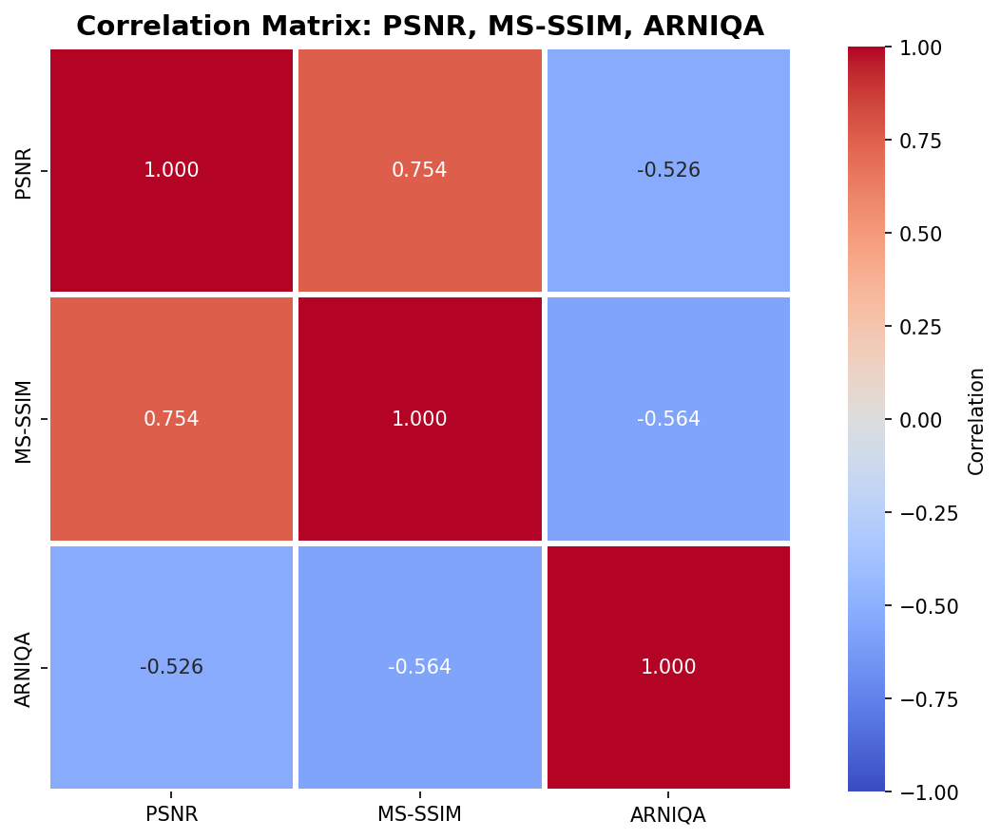

# Récapitulatif - Métriques pour évaluation des performances de MedVAE sur ARCADE (comparaison entrée/sortie)

---

## 1. Choix de la métrique sans référence pour tester la qualité de l'image d'entrée

Nous avons choisi d'utiliser la métrique ARNIQA comme conseillée par l'encadrante du projet.
Le script `run_arniqa.py` permet la création d'un `.csv` contenant pour chacune des images du dataset (3000 images) un score ARNIQA.

Nous avons aussi utilisé un score composite unique qui est calculé comme la moyenne non pondérée de 7 métriques normalisées (min-max). La moyenne est calculée sur les métriques suivantes : Laplacian Variance, Tenengrad, RMS Contrast, Immerkaer σ, NIQE et BRISQUE (lire le `recap.md` de Théophile).

Il faut lancer le script `quality_metrics.ipynb` pour obtenir le `.csv` contenant le score composite des images.

## 2. Choix de la métrique avec référence pour tester la qualité de reconstruction de MedVAE

PSNR et MS-SSIM étant utilisés dans le papier MedVAE, il est plutôt naturel pour l'instant de se cantonner à ces deux indices. Le script `run_reconstruction_metrics.py` renvoie un `.csv` contenant le PSNR ainsi que le MS-SSIM de chaque image (inférence dans MedVAE).

## 3. Analyse des résultats, comparaisons, corrélations

L'affichage des métriques avec référence par rapport à ARNIQA sur un plan 2D ne permet pas vraiment de mettre en lumière une quelconque corrélation (nuage de points diffus).

Le script `plot_metrics.py` renvoie aussi une matrice de corrélation qui permet de comprendre que PSNR et MS-SSIM sont corrélés négativement à ARNIQA ce qui signifie :
- plus l'image d'entrée est de bonne qualité au sens de l'indice ARNIQA (ARNIQA élevé = qualité élevée) plus le PSNR/SSIM est mauvais en sortie (un PSNR/SSIM faible indique une mauvaise reconstruction).

Ce résultat est plutôt contre-intuitif, mais on peut peut-être l'expliquer avec le biais de l'indice ARNIQA, celui-ci est entraîné sur des photos naturelles, peut-être que les caractéristiques n'ont pas de sens avec les données dont on dispose.

On pourrait émettre l'hypothèse de l'effet passe-bas des VAEs. Les VAEs ont tendance à moyenner les détails haute fréquence, ils produisent des reconstructions légèrement floues/lissées. Le VAE produira donc une meilleure reconstruction si l'entrée ne possède pas de trop hautes fréquences (la sortie sera plus fidèle à l'entrée).

## 4. Conclusion et perspectives

Les résultats actuels ne permettent pas de conclure clairement sur l'impact de la qualité de l'image d'entrée sur la reconstruction de MedVAE, notamment à cause du biais de domaine d'ARNIQA. Pour la suite, nous allons appliquer des dégradations synthétiques contrôlées (bruit, flou, compression) sur les images propres du dataset avant de les passer dans MedVAE. Cela permettra de tester si la qualité de l'image d'entrée a un réel impact sur la qualité de reconstruction, tout en s'assurant qu'ARNIQA est utilisé dans des conditions pour lesquelles il a été entraîné.