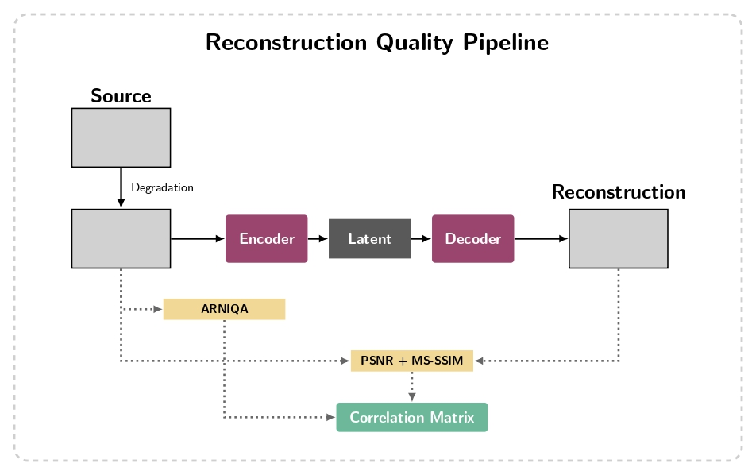

# Récapitulatif - Métriques pour évaluation des performances de MedVAE sur ARCADE (comparaison entrée/sortie)

---

## 1. Choix de la métrique sans référence pour tester la qualité de l'image d'entrée

Nous avons choisi d'utiliser la métrique ARNIQA comme conseillée par l'encadrante du projet.
Le script `run_arniqa.py` permet la création d'un `.csv` contenant pour chacune des images du dataset (3000 images) un score ARNIQA. Il est à noter que pour l'instant aucune dégradation n'est appliquée au dataset et que cette étape préliminaire permet de voir si il est deja possible d'observer le comportant d'ARNIQA sur le dataset.

Nous avons aussi utilisé un score composite unique qui est calculé comme la moyenne non pondérée de 7 métriques normalisées (min-max). La moyenne est calculée sur les métriques suivantes : Laplacian Variance, Tenengrad, RMS Contrast, Immerkaer σ, NIQE et BRISQUE (lire le `recap.md` de Théophile).

Il faut lancer le script `quality_metrics.ipynb` pour obtenir le `.csv` contenant le score composite des images.

## 2. Choix de la métrique avec référence pour tester la qualité de reconstruction de MedVAE

PSNR et MS-SSIM étant utilisés dans le papier MedVAE, il est plutôt naturel pour l'instant de se cantonner à ces deux indices. Le script `run_reconstruction_metrics.py` renvoie un `.csv` contenant le PSNR ainsi que le MS-SSIM de chaque image (inférence dans MedVAE).

## 3. Analyse des résultats, comparaisons, corrélations

L'affichage des métriques avec référence par rapport à ARNIQA sur un plan 2D ne permet pas vraiment de mettre en lumière une quelconque corrélation (nuage de points diffus). 

Le script `plot_metrics.py` renvoie aussi une matrice de corrélation qui permet de comprendre que PSNR et MS-SSIM sont corrélés négativement à ARNIQA ce qui signifie :
- plus l'image d'entrée est de bonne qualité au sens de l'indice ARNIQA (ARNIQA élevé = qualité élevée) plus le PSNR/SSIM est mauvais en sortie (un PSNR/SSIM faible indique une mauvaise reconstruction).

Ce résultat est plutôt contre-intuitif, mais on peut peut-être l'expliquer avec le biais de l'indice ARNIQA, celui-ci est entraîné sur des photos naturelles, peut-être que les caractéristiques n'ont pas de sens avec les données dont on dispose. ARNIQA ne permet pas (ce qui est naturel ici puisqu'il s'agit d'images médicales) de determiner quelles sont les images de "haute qualité" au sens de la perception humaine sur des images de ce type.

À noter aussi que la corrélation est calculée sur un nuage très bruité.

## 4. Dégradations synthétiques contrôlées — sweep sur 50 niveaux
Pour lever l'ambiguïté de l'analyse précédente, on applique des dégradations synthétiques contrôlées sur 1000 images propres du dataset avant de les passer dans MedVAE. L'idée est de forcer une variation connue de la qualité d'entrée et d'observer comment PSNR et MS-SSIM évoluent en fonction du score ARNIQA calculé sur l'image dégradée.

Le script `run_degradation_sweep.py` implémente une rampe linéaire sur 50 niveaux combinant trois types de dégradation simultanément :
- Bruit gaussien additif : σ ∈ [0, 80]
- Flou gaussien : noyau ∈ [1, 31] px
- Compression JPEG : qualité ∈ [95, 5]

Pour chaque niveau, ARNIQA, PSNR et MS-SSIM sont moyennés sur les 100 images. Les résultats sont sauvegardés dans `outputs/degradation/degradation_results.csv`.

### Analyse des résultats

La tendance générale est confirmée : quand la qualité d'entrée baisse (PSNR/MS-SSIM de reconstruction bas), ARNIQA tend à être plus élevé, et inversement. Cela va dans le sens de la corrélation négative observée à l'étape 3, cette fois de façon causale et contrôlée.

Cependant, la courbe ARNIQA en fonction du niveau de dégradation n'est **pas monotone** : elle remonte significativement entre les niveaux 9 et 28. Cela s'explique par le biais de domaine d'ARNIQA — entraîné sur des photos naturelles, il interprète le flou gaussien comme un signe de qualité (image lisse, sans bruit apparent), alors même que l'image médicale est objectivement dégradée. Le score ARNIQA reflète donc davantage l'absence de bruit haute fréquence que la qualité diagnostique réelle de l'image.

Ce comportement confirme qu'ARNIQA n'est pas un indicateur fiable de la qualité d'entrée pour ce type de données, et qu'il ne peut pas être utilisé seul comme axe de comparaison pour cette étude.

## 5. Conclusion et perspectives

L'ensemble des expériences menées — sur les images brutes comme sur les images synthétiquement dégradées — converge vers le même constat : **ARNIQA n'est pas adapté aux images angiographiques coronariennes**. Son biais vers les photos naturelles le rend insensible aux dégradations pertinentes pour l'imagerie médicale (compression JPEG, bruit de capteur) et trompeur face au flou qu'il interprète positivement.

Pour la suite, deux pistes complémentaires sont envisagées :

**Option A — Sweeps de dégradations séparés par type**
Plutôt que de combiner les trois dégradations en une seule rampe, on peut faire trois sweeps indépendants (bruit seul, flou seul, compression seule). Cela permettrait d'isoler l'effet de chaque dégradation sur PSNR/MS-SSIM, et d'identifier laquelle impacte le plus la reconstruction MedVAE. Attention cependant à ne pas dériver vers une étude d'ARNIQA : l'objectif reste l'évaluation de MedVAE, ARNIQA n'est qu'un moyen de quantifier la qualité d'entrée.

**Option B — Remplacement d'ARNIQA par le score composite de Théophile**
Le score composite développé en parallèle agrège plusieurs métriques sans référence (dont NIQE et BRISQUE) moins sensibles au biais flou qu'ARNIQA. Une version mise à jour de ce score est disponible (voir `recap.md` de Théophile). L'utiliser comme axe de qualité d'entrée à la place d'ARNIQA permettrait d'obtenir une courbe plus monotone et plus interprétable, tout en restant dans le cadre de métriques sans référence adaptées aux images médicales.

Ces deux pistes sont complémentaires et peuvent être menées en parallèle.
